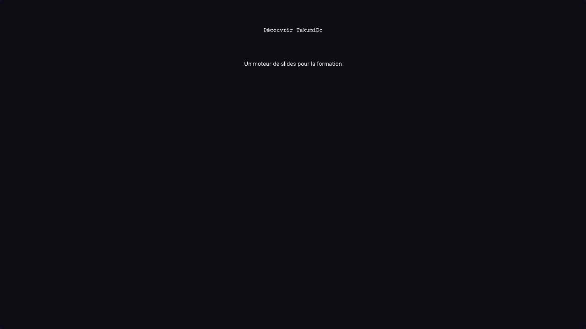
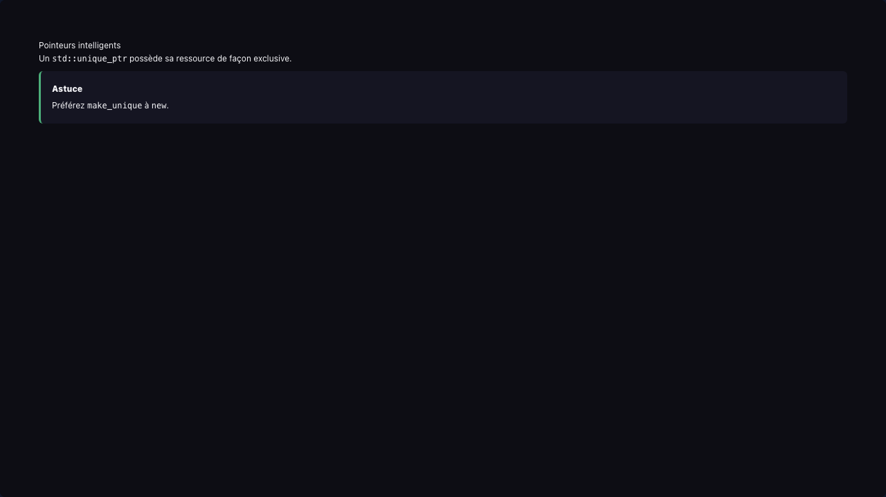
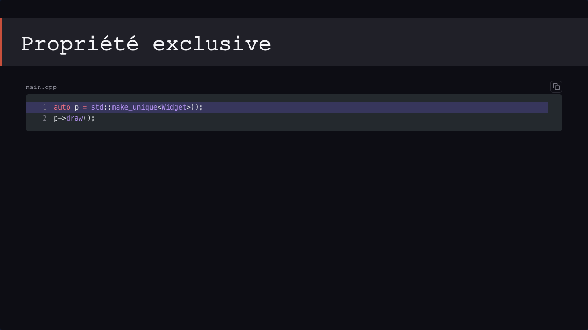
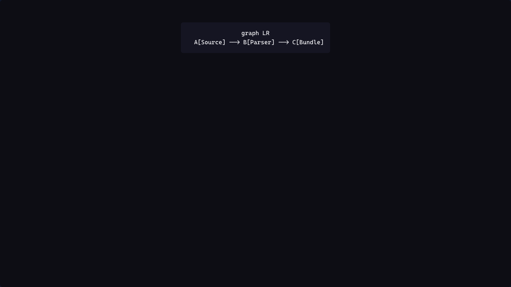
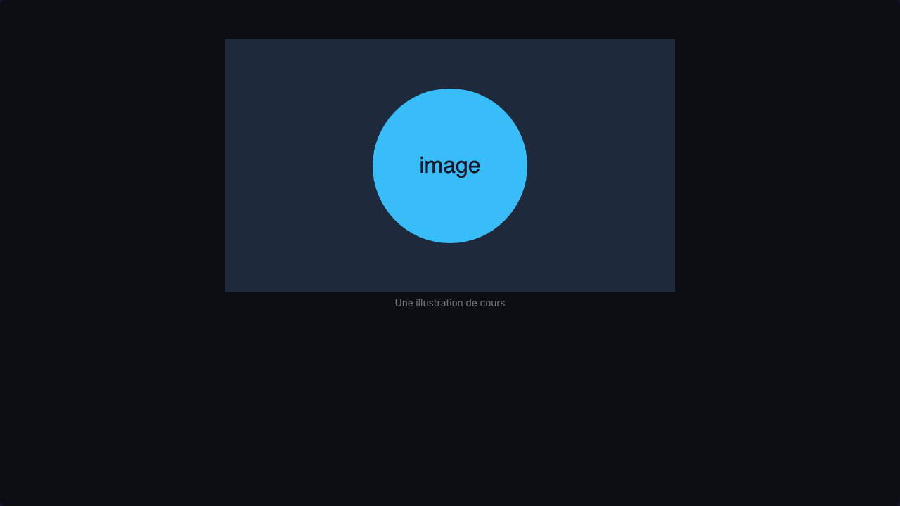
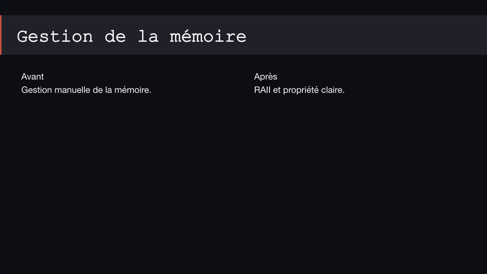

# takumido-course-example

Bilingual showcase training for the [TakumiDô](https://takumido.app) platform.

## About this course

**"Discover TakumiDô"** is an introductory training (≈ 45 min) that demonstrates the platform's content pipeline and live session features. It serves as:

- A **test fixture** for the TakumiDô content pipeline (parsing, rendering, i18n)
- A **documentary showcase** for content creators building their own courses
- A **reference implementation** of the course repository structure (Option E)

Languages: English (default), French.

**Pedagogical coverage (v1.0.0):** a four-chapter narrative journey — the Takumi spirit, why TakumiDô is different, the apprentice experience (Play/Pause, HWM progressive unlock, reconnection), and the trainer's power (tempo, progress tracking, curriculum-as-code) — with two honest, isolated "Coming soon" roadmaps.

## Pedagogical coverage

The course is a narrative arc, not a feature list: `course-opening` → four chapters → `course-closing`, with an `intermission` breather between Ch.2 and Ch.3.

### Chapter 1 — The Takumi Spirit (`01-esprit-takumi`)
What a Takumi is, the opening mantra, the discipline → practice → mastery way, and the fixed TakumiDô mantras. Structural illustration **S1** (the three-beat frieze).

### Chapter 2 — Why TakumiDô (`02-pourquoi`)
The classic-platform observation (not an attack), **curriculum-as-code** as the founding differentiator, and guided live vs replay. Structural illustration **S2** (curriculum-as-code git tree).

### Chapter 3 — Apprentice Side (`03-apprenti`)
The apprentice experience (join, Play/Pause), **progressive unlocking** via the High-Water Mark, and resuming without loss (reconnection). Structural illustration **S3** (HWM diagram). Ends on an isolated **Coming soon — Apprentice** roadmap.

### Chapter 4 — Trainer Side (`04-formateur`)
Leading the way (the Play/Pause tempo), tracking progress (three-column cockpit + HWM marker), and **curriculum-as-code for authors** (reusing the git-tree illustration, **S4**). Ends on an isolated **Coming soon — graphical editing** roadmap, then a narrative closing that bookends Ch.1.

## Repository structure

```
takumido-course-example/
├── course.yaml                         # Root manifest (schema v1) — outline
├── i18n/
│   ├── en.yaml                         # English translations (course + chapter + roadmap labels)
│   └── fr.yaml                         # French translations
├── theme/                              # Washi palette, brand tokens (Story 5.1)
├── layouts/                            # Custom narrative layouts (Story 5.4)
│   ├── concept.layout.yaml
│   ├── feature.layout.yaml
│   ├── comparison.layout.yaml
│   ├── closing.layout.yaml
│   ├── pause.layout.yaml
│   └── spotlight.layout.yaml
├── slides/                             # Standalone (out-of-chapter) slides
│   ├── course-opening.slide/
│   ├── intermission.slide/             # Layout: pause
│   └── course-closing.slide/
└── chapters/
    ├── 01-esprit-takumi/               # Ch.1 — The Takumi Spirit
    ├── 02-pourquoi/                    # Ch.2 — Why TakumiDô
    ├── 03-apprenti/                    # Ch.3 — Apprentice Side
    └── 04-formateur/                   # Ch.4 — Trainer Side
```

## Layouts

A layout describes **where content goes** on a slide. It declares typed **slots**
(content regions) and a **composition** (how those regions are arranged: `stack`,
`grid` or `flex`). A slide picks a layout by id in its `meta.yaml`, then fills the
slots from its Markdown (`::: slot <name>` blocks).

There are two kinds:

- **Primitive layouts** (`takumido-*`) — provided by the TakumiDô platform. They
  cover the common slide shapes and need no setup. The `takumido-` prefix is
  **reserved**: a custom layout may not use it.
- **Custom layouts** — defined in this repository under `layouts/<id>.layout.yaml`,
  using the exact same DSL. The pipeline exposes them to the renderer alongside the
  primitives.

### Primitive layouts

Screenshots below are POC renders with the default theme (course-specific theming
arrives in a later milestone); they illustrate the **structure** of each layout.

#### `takumido-title`

Title slide — a visible centered title with an optional subtitle.
Slots: `title` (text, required), `subtitle` (text, optional). Composition: `stack`.



#### `takumido-text`

General prose slide. Slot: `body` (text / callout / list, one or more).
Composition: `stack`.



#### `takumido-code`

A single code block, full width. Slot: `body` (code, exactly one).
Composition: `stack`.



#### `takumido-mermaid`

A single, centered Mermaid diagram. Slot: `body` (mermaid, exactly one).
Composition: `stack`.



#### `takumido-image`

A single, centered image with an optional caption. Slot: `body` (image, exactly
one). Composition: `stack`.



#### `takumido-columns`

Two side-by-side columns. Slots: `left`, `right` (any block kind, each one or
more). Composition: `grid` (`1fr 1fr`).



#### `takumido-grid`

A wrapping grid of cells. Slot: `cells` (any block kind, one or more).
Composition: `flex` (row, wrap).


> `takumido-quiz` (slot `body`: quiz, exactly one) is **reserved for a future
> milestone** — it has no renderer yet and is intentionally not shown here.

### Custom narrative layouts

Beyond `spotlight`, the showcase redesign (Story 5.4) added a small family of
course-authored narrative layouts under `layouts/`, each a live demo of custom
authoring with the same DSL as the platform primitives:

- **`concept`** — one key idea: title band, strong central statement, optional muted note.
- **`feature`** — one capability with an in-house illustration (text-dominant body + `visual`).
- **`comparison`** — two symmetrical panes (live vs replay).
- **`closing`** — a centred narrative sign-off (title with no band — an intentional exception).
- **`pause`** — a full-bleed breather (used by the `intermission` standalone).
- **`spotlight`** — a headline band above a wide `detail` + narrower `aside`.

The platform also provides `takumido-*` primitives consumed by the course, notably
`takumido-chapter-opening` (per-chapter opening) and `takumido-roadmap` (the
data-driven "Coming soon" rail, fed by a per-slide `assets/roadmap.yaml`).

## Versioning

This repository follows [semver](https://semver.org/). The TakumiDô backend resolves courses by git tag.

- `v0.1.0` — Initial release with 2 chapters, 4 slides, bilingual content
- `v0.2.0` — 2 chapters, 5 slides, spotlight custom layout
- `v0.3.0` — 3 chapters, 12 slides — covers Play, Pause, rewind, HWM, chapter menu, reconnection
- `v1.0.0` — Showcase redesign (Epic 5): washi visual identity, four-chapter narrative journey, three in-house illustrations (S1–S3, S4 reusing S2), two isolated "Coming soon" roadmaps
