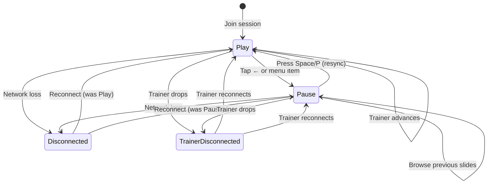

# The Play & Pause Loop

> How apprentices navigate freely while staying aware of the trainer's position.

::: slot left

In **Play** mode, the apprentice follows the trainer's slides automatically. Every time the trainer advances, the apprentice's view updates instantly.

Pressing **Space** or **P**, or tapping a previous slide in the chapter menu, switches to **Pause** mode. The apprentice can then browse any previously presented slide freely.

To return to live sync, the apprentice presses **Space** or **P** again, or taps the Play button. The view jumps back to the trainer's current position.

Slides beyond the trainer's furthest point (the **High-Water Mark**) remain locked — the apprentice can only revisit content already covered.

:::

::: slot right

:::
