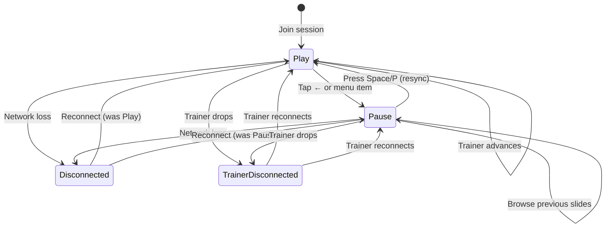

# La boucle Play & Pause

> Comment les apprentis naviguent librement tout en restant informés de la position du formateur.

::: slot left

En mode **Play**, l'apprenti suit automatiquement les slides du formateur. À chaque avancée du formateur, la vue de l'apprenti se met à jour instantanément.

En appuyant sur **Espace** ou **P**, ou en cliquant sur une slide précédente dans le menu des chapitres, l'apprenti passe en mode **Pause**. Il peut alors parcourir librement toute slide déjà présentée.

Pour revenir à la synchronisation live, l'apprenti appuie sur **Espace** ou **P** à nouveau, ou clique sur le bouton Play. La vue revient à la position actuelle du formateur.

Les slides au-delà du point le plus avancé du formateur (la **High-Water Mark**) restent verrouillées — l'apprenti ne peut revisiter que le contenu déjà couvert.

:::

::: slot right

:::
